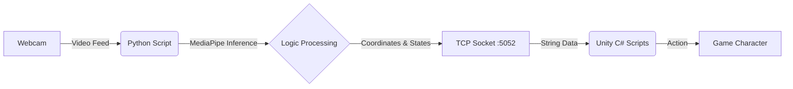

# HAU Active 🏃‍♂️🎮

**A computer vision-based fitness game built with Unity 3D and MediaPipe.**

> **Author:** Nguyễn Vũ Minh Long  
> **Institution:** Hanoi Architectural University (Faculty of IT)  
> **Thesis Project:** 2026


## 📖 Overview

**HAU Active** is an "Exergame" (Exercise Game) designed to combat sedentary lifestyles among students. It allows players to control a 3D character in an endless runner game using real-time body movements captured by a standard webcam.

Unlike traditional Kinect or VR setups, HAU Active requires **no wearable sensors or expensive hardware**. It utilizes a Python backend to process video feeds via **Google MediaPipe** and transmits skeletal data to a **Unity** frontend via TCP Sockets.

### Key Features

-   **Touchless Interface:** Navigate menus and play games using hand gestures.
-   **Endless Runner Mode:** Lean left/right to switch lanes, jump to clear hurdles, and squat to slide under obstacles.
-   **Mini-Games:**
    -   _Fruit Slicing:_ Hand-tracking based reflex game.
    -   _Shape Fitting:_ Upper-body pose matching game.
-   **Dynamic Calibration:** Algorithm automatically adjusts to the player's height and distance from the camera.
-   **HAU Campus Environment:** A 3D recreation of the Hanoi Architectural University hallways.

---

## ⚙️ System Architecture

The system operates on a Client-Server model running on the local machine (`localhost`):

1.  **Server (Python):** Captures webcam input, processes frames using OpenCV and MediaPipe (Pose & Hands), calculates logic (Jump/Squat/Lean), and sends data strings.
2.  **Client (Unity):** Listens on a TCP port, parses the data string, and maps coordinates to the 3D character controller and UI cursor.



---

## 📂 Project Structure

```text
.
├── Fruit/                  # Scripts for Fruit Slicing Mini-game
├── Hole/                   # Scripts for Wall/Shape Fitting Mini-game
├── Menu&Shop/              # UI Logic and Menu Management
├── Run/                    # Core Endless Runner Logic (PlayerController, Spawning)
├── Python-Mediapipe/       # Computer Vision Backend
│   ├── app/
│   │   ├── config.py       # Thresholds and Port Config
│   │   ├── detection.py    # Core MediaPipe Logic
│   │   ├── main.py         # Socket Server Entry Point
│   │   └── window_manager.py
│   ├── main.py             # Root runner
│   └── requirements.txt    # Python dependencies
├── CursorController.cs     # Hand-tracking cursor logic
├── SocketClient.cs         # TCP Connection Handler
└── ...
```

---

## 🚀 Installation & Setup

### Prerequisites

-   **OS:** Windows 10/11 (Recommended)
-   **Unity:** Version 2020.3 or later (LTS recommended).
-   **Python:** Version 3.8 - 3.10.
-   **Hardware:** Webcam.

### 1. Python Environment Setup

Navigate to the Python backend directory and install dependencies.

```bash
cd Python-Mediapipe
# Optional: Create a virtual environment
python -m venv venv
# Windows: venv\Scripts\activate
# Mac/Linux: source venv/bin/activate

# Install requirements
pip install -r requirements.txt
```

_Dependencies include: `opencv-python`, `mediapipe`, `numpy`._

### 2. Unity Project Setup

1.  Open **Unity Hub**.
2.  Add the project root directory.
3.  Open the project.
4.  Ensure the active scene is set to **Menu** (found in `Assets/Scenes` typically).

---

## 🎮 How to Run

**Important:** You must start the Python server _before_ or _simultaneously_ with the Unity game for the connection to establish.

### Step 1: Start the Vision Engine

Run the Python script. It will open a webcam window and wait for the Unity client.

```bash
# Inside Python-Mediapipe folder
python main.py
```

_Console Output:_ `[MediaPipe] Server started on 127.0.0.1:5052`

### Step 2: Start the Game

1.  Press **Play** in the Unity Editor.
2.  The `SocketClient` will connect to the Python server.
3.  Use your hand to control the on-screen cursor. Hover over **START** to begin.

### Step 3: Calibration (The "Lock" Gesture)

To start running, perform the **Lock Pose**:

-   Stand 1.5m - 2m away from the camera.
-   **Clap your hands together** (or hold wrists close) in front of your chest.
-   The Python window will print `locked`, and the game will begin.

---

## 🕹️ Controls

### Menu Navigation

-   **Hand Tracking:** Move your hand to move the red square cursor.
-   **Click:** Hover over a button for **2 seconds** to trigger a click.

### Endless Runner (Main Game)

-   **Run:** Automatic forward movement.
-   **Jump:** Jump physically (Raise body center above threshold).
-   **Slide/Crouch:** Squat physically (Lower body center below threshold).
-   **Move Left/Right:** Lean or step to the left/right.

### Mini-Games

-   **Fruit Slicing:** Move hand rapidly to control the blade. Avoid bombs!
-   **Wall Fit:** Align your upper body/arms to fit through the cutout shape in the wall.

---

## 🛠️ Configuration

You can tweak sensitivity and detection settings in `Python-Mediapipe/app/config.py`:

```python
HOST = "127.0.0.1"
PORT = 5052
threshold_clap = 0.08      # Sensitivity for the Start gesture
threshold_horizontal = 0   # Leaning sensitivity
threshold_vertical = -0.2  # Jump/Squat sensitivity
```

---

## 🐛 Troubleshooting

| Issue                             | Solution                                                                                                                  |
| :-------------------------------- | :------------------------------------------------------------------------------------------------------------------------ |
| **Unity console: "Socket error"** | Ensure `main.py` is running _before_ you press Play in Unity. Check firewall settings for port 5052.                      |
| **Character moves erratically**   | Ensure good lighting. Avoid backlighting (windows behind you). Stand 1.5m away so your full body is visible.              |
| **Lag / Low FPS**                 | Close other heavy applications. In Python, ensure the webcam resolution isn't set too high (defaults to system standard). |
| **"Lock" gesture not working**    | Ensure your hands are clearly visible and wrists are close together. Check the Python console for "locked" message.       |

---

## 👨‍💻 Contributors

-   **Developer:** Nguyễn Vũ Minh Long (Class 21CN1)
-   **Supervisor:** ThS. Nguyễn Quốc Huy

---

## 📜 License

This project is part of a university graduation thesis. Please contact the author for usage rights regarding commercial distribution.
