# 🏃‍♂️ HAU Active: Game Vận Động Tương Tác Không Chạm (Exergame)

<div align="center">


**Ứng dụng Thị giác Máy tính (Computer Vision) & AI Nhận diện Tư thế Thời gian thực để Điều khiển Nhân vật Game trên nền tảng Unity 3D**

[](https://unity.com/)
[](https://www.python.org/)
[](https://developers.google.com/mediapipe)
[](https://opencv.org/)
[](https://www.blender.org/)
[](#-thông-tin-đồ-án--tác-giả)

[📖 Giới thiệu](#-tổng-quan-dự-án) •
[⚙️ Kiến trúc Hệ thống](#️-kiến-trúc-hệ-thống--luồng-dữ-liệu) •
[🧠 Giải thuật Thị giác](#-thuật-toán-thị-giác-máy-tính--ai) •
[🎮 Chế độ Chơi](#-các-chế-độ-chơi-gameplay-modes) •
[🏛️ Môi trường 3D](#️-tài-nguyên--môi-trường-3d-khoa-cntt-hau) •
[🚀 Cài đặt & Khởi chạy](#-hướng-dẫn-cài-đặt--khởi-chạy) •
[📊 Đánh giá Thực nghiệm](#-kết-quả-thực-nghiệm--đánh-giá) •
[🎥 Video Demo](#-video-demo-thực-tế)

</div>

---

## 📌 Mục lục

- [🏃‍♂️ HAU Active: Game Vận Động Tương Tác Không Chạm (Exergame)](#️-hau-active-game-vận-động-tương-tác-không-chạm-exergame)
  - [📌 Mục lục](#-mục-lục)
  - [📖 Tổng quan Dự án](#-tổng-quan-dự-án)
    - [Bối cảnh & Vấn đề giải quyết](#bối-cảnh--vấn-đề-giải-quyết)
    - [Giải pháp của HAU Active](#giải-pháp-của-hau-active)
    - [Điểm nổi bật của dự án](#điểm-nổi-bật-của-dự-án)
  - [⚙️ Kiến trúc Hệ thống & Luồng Dữ liệu](#️-kiến-trúc-hệ-thống--luồng-dữ-liệu)
    - [1. Sơ đồ Pipeline tổng thể (Webcam $\rightarrow$ Python AI $\rightarrow$ Unity 3D)](#1-sơ-đồ-pipeline-tổng-thể-webcam-rightarrow-python-ai-rightarrow-unity-3d)
    - [2. Giao thức Truyền thông TCP Socket đa luồng](#2-giao-thức-truyền-thông-tcp-socket-đa-luồng)
    - [3. Cấu trúc Gói tin Dữ liệu (Packet Protocol)](#3-cấu-trúc-gói-tin-dữ-liệu-packet-protocol)
  - [🧠 Thuật toán Thị giác Máy tính & AI](#-thuật-toán-thị-giác-máy-tính--ai)
    - [1. Lựa chọn Mô hình: MediaPipe Pose vs MoveNet](#1-lựa-chọn-mô-hình-mediapipe-pose-vs-movenet)
    - [2. Thuật toán Tính toán Trọng tâm Cơ thể (Body Center of Gravity)](#2-thuật-toán-tính-toán-trọng-tâm-cơ-thể-body-center-of-gravity)
    - [3. Cơ chế Khóa & Cân chỉnh Ngưỡng Động (Dynamic Threshold Calibration)](#3-cơ-chế-khóa--cân-chỉnh-ngưỡng-động-dynamic-threshold-calibration)
    - [4. Nhận diện Bàn tay & Con trỏ Không chạm (Touchless Hand Tracking)](#4-nhận-diện-bàn-tay--con-trỏ-không-chạm-touchless-hand-tracking)
  - [🎮 Các Chế độ Chơi (Gameplay Modes)](#-các-chế-độ-chơi-gameplay-modes)
    - [Chế độ 1: Chạy vô tận (Endless Runner - Core Mode)](#chế-độ-1-chạy-vô-tận-endless-runner---core-mode)
    - [Chế độ 2: Chém hoa quả (Fruit Slicing Mini-game)](#chế-độ-2-chém-hoa-quả-fruit-slicing-mini-game)
    - [Chế độ 3: Tạo dáng qua tường (Wall Shape-Fitting Mini-game)](#chế-độ-3-tạo-dáng-qua-tường-wall-shape-fitting-mini-game)
  - [🏛️ Tài nguyên & Môi trường 3D Khoa CNTT HAU](#️-tài-nguyên--môi-trường-3d-khoa-cntt-hau)
    - [1. Tái hiện Giảng đường Khoa CNTT Đại học Kiến trúc Hà Nội](#1-tái-hiện-giảng-đường-khoa-cntt-đại-học-kiến-trúc-hà-nội)
    - [2. Thuật toán Sinh màn chơi Thủ tục & Quản lý Bộ nhớ (Procedural Generation & Pooling)](#2-thuật-toán-sinh-màn-chơi-thủ-tục--quản-lý-bộ-nhớ-procedural-generation--pooling)
    - [3. Hệ thống Vật thể Tương tác & Chướng ngại vật](#3-hệ-thống-vật-thể-tương-tác--chướng-ngại-vật)
  - [🖥️ Giao diện Người dùng Không chạm (Touchless UI/UX)](#️-giao-diện-người-dùng-không-chạm-touchless-uiux)
  - [🚀 Hướng dẫn Cài đặt & Khởi chạy](#-hướng-dẫn-cài-đặt--khởi-chạy)
    - [Yêu cầu Hệ thống](#yêu-cầu-hệ-thống)
    - [Bước 1: Cài đặt & Chạy Python AI Backend](#bước-1-cài-đặt--chạy-python-ai-backend)
    - [Bước 2: Mở & Chạy Unity Frontend](#bước-2-mở--chạy-unity-frontend)
    - [Bước 3: Cân chỉnh Tư thế Khởi động (Calibration)](#bước-3-cân-chỉnh-tư-thế-khởi-động-calibration)
  - [🕹️ Bảng Điều khiển & Thao tác Vận động](#️-bảng-điều-khiển--thao-tác-vận-động)
  - [📊 Kết quả Thực nghiệm & Đánh giá](#-kết-quả-thực-nghiệm--đánh-giá)
    - [1. Hiệu năng Kỹ thuật & Độ trễ (FPS & Latency)](#1-hiệu-năng-kỹ-thuật--độ-trễ-fps--latency)
    - [2. Hiệu quả Đốt cháy Năng lượng (Caloric & METs Analysis)](#2-hiệu-quả-đốt-cháy-năng-lượng-caloric--mets-analysis)
    - [3. Đánh giá Trải nghiệm Người dùng (Beta Testing Survey)](#3-đánh-giá-trải-nghiệm-người-dùng-beta-testing-survey)
  - [🎥 Video Demo Thực tế](#-video-demo-thực-tế)
  - [📁 Cấu trúc Thư mục Dự án](#-cấu-trúc-thư-mục-dự-án)
  - [🛠️ Xử lý Sự cố Thường gặp (Troubleshooting)](#️-xử-lý-sự-cố-thường-gặp-troubleshooting)
  - [👨‍💻 Thông tin Đồ án & Tác giả](#-thông-tin-đồ-án--tác-giả)

---

## 📖 Tổng quan Dự án

### Bối cảnh & Vấn đề giải quyết
Trong thời đại số hóa, lối sống tĩnh tại (sedentary lifestyle) và thói quen ngồi máy tính kéo dài đang trở thành nguyên nhân hàng đầu gây ra các bệnh lý mãn tính (béo phì, đau cột sống, suy giảm thị lực, bệnh tim mạch), đặc biệt ở đối tượng **sinh viên Công nghệ Thông tin**.

Các dòng game vận động thương mại nổi tiếng (*Wii Sports*, *Xbox Kinect Sports*, *Nintendo Ring Fit Adventure*) đã chứng minh được hiệu quả sức khỏe vượt trội. Tuy nhiên, chúng đòi hỏi **phần cứng đắt đỏ** (máy console chuyên dụng, tay cầm cảm biến gia tốc, thảm nhảy hoặc camera hồng ngoại chiều sâu) cùng **không gian lắp đặt lớn**, tạo nên rào cản chi phí rất lớn đối với đa số sinh viên.

<div align="center">
  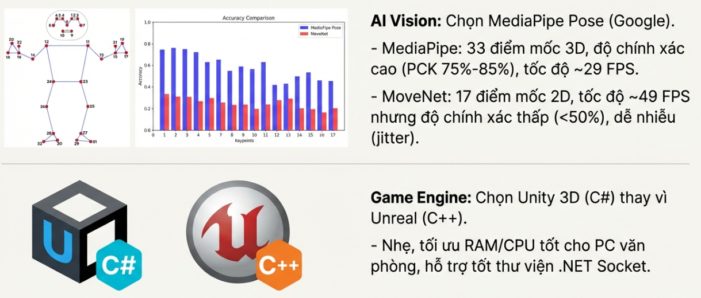
</div>

### Giải pháp của HAU Active
**HAU Active** là một tựa game vận động thể chất tương tác (**Exergame**) được xây dựng trên **Unity 3D**, ứng dụng các mô hình học sâu (Deep Learning) và Thị giác máy tính (Computer Vision) chạy trên **Python (Google MediaPipe BlazePose & Hands)**:
- **Hoàn toàn Không chạm (Zero-Touch):** Không cần tay cầm, bàn phím, chuột hay cảm biến vật lý.
- **Tận dụng Webcam Phổ thông:** Chạy mượt mà trên camera laptop hoặc webcam USB tiêu chuẩn.
- **Bản địa hóa Giảng đường HAU:** Tái hiện chân thực hành lang Khoa Công nghệ Thông tin - Trường Đại học Kiến trúc Hà Nội dưới dạng không gian 3D.
- **Trò chơi hóa Bài tập Thể dục:** Ép người chơi chạy tại chỗ, nhảy cao (Jump), ngồi xổm sâu (Squat), nghiêng lườn (Side-step) và vung tay phản xạ liên tục.

### Điểm nổi bật của dự án
1. **Kiến trúc Client-Server tốc độ cao:** Giao tiếp thời gian thực qua **TCP Socket (Port 5052)** và **UDP (Port 5053)** với độ trễ siêu thấp ($\approx 30 - 40\text{ ms}$).
2. **Thuật toán Ngưỡng Động (Dynamic Thresholds):** Tự động thích ứng với chiều cao, vóc dáng người chơi và khoảng cách camera ($1.5\text{m} - 2.5\text{m}$).
3. **Cơ chế Khóa cử chỉ (Clap Lock Gesture):** Cân chỉnh khoảng cách tức thì chỉ bằng một động tác chắp tay / vỗ tay trước ngực.
4. **Hệ thống Đa Chế độ Chơi:** Tích hợp 3 gameplay phong phú: Chạy vô tận vượt chướng ngại vật, Chém hoa quả phản xạ tay, và Tạo dáng xuyên lỗ tường.

---

## ⚙️ Kiến trúc Hệ thống & Luồng Dữ liệu

### 1. Sơ đồ Pipeline tổng thể (Webcam $\rightarrow$ Python AI $\rightarrow$ Unity 3D)

Hệ thống hoạt động theo mô hình ống dẫn dữ liệu thời gian thực (Real-time Processing Pipeline):

<div align="center">
  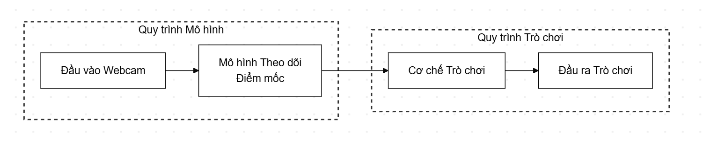
  <p><em>Hình 1: Sơ đồ luồng xử lý toàn trình từ Webcam đến chuyển động nhân vật trong Unity 3D</em></p>
</div>

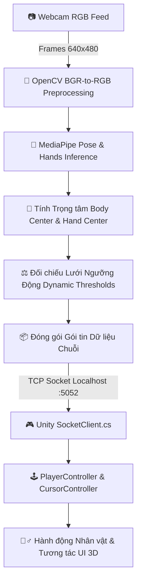

### 2. Giao thức Truyền thông TCP Socket đa luồng

Để đảm bảo hiệu năng và không gây nghẽn Game Loop của Unity, hệ thống tách biệt thành 2 tiến trình độc lập:

<div align="center">
  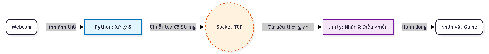
  <p><em>Hình 2: Cơ chế truyền nhận dữ liệu qua TCP/IP Localhost giữa Python Server và Unity Client</em></p>
</div>

- **Python Server (`main.py`):** Lắng nghe kết nối tại `127.0.0.1:5052`, xử lý khung hình camera, ước lượng khung xương và phát tín hiệu stream liên tục.
- **Unity Client ([`SocketClient.cs`](file:///c:/Users/minhlong/Desktop/game/hau-active-game/Assets/Scripts/SocketClient.cs)):** Sử dụng luồng nền (Thread/Non-blocking Stream) để liên tục tiếp nhận mảng byte, giải mã chuỗi ASCII và truyền dữ liệu cho các bộ điều khiển logic.

### 3. Cấu trúc Gói tin Dữ liệu (Packet Protocol)

Dữ liệu được đóng gói thành chuỗi văn bản (String) tối giản để tiết kiệm băng thông và tối thiểu hóa thời gian phân tích cú pháp (Serialization overhead):

$$\text{Packet} = \texttt{"[FullBody Landmarks], (Hand\_X, Hand\_Y), (Center\_X, Center\_Y), Move\_Code"}$$

*Ví dụ gói tin thực tế:*
```text
"[[312, 145], [290, 210], ..., [340, 420]], (485, 230), (320, 240), 3"
```

| Trường Dữ liệu | Định dạng | Ý nghĩa kỹ thuật |
| :--- | :--- | :--- |
| `FullBody Landmarks` | `[[x1,y1], [x2,y2], ...]` | Tọa độ điểm mốc xương khớp thân trên (phục vụ chế độ Tạo dáng tường) |
| `(Hand_X, Hand_Y)` | `(int, int)` | Tọa độ trọng tâm bàn tay phải (điều khiển con trỏ menu & vệt dao chém) |
| `(Center_X, Center_Y)` | `(int, int)` | Tọa độ trọng tâm thân trên của người chơi |
| `Move_Code` | `int (0 - 5)` | Mã trạng thái hành động vận động thời gian thực |

**Bảng mã lệnh hành động (`Move_Code`):**
- `0`: **Idle** (Đứng yên trong vùng an toàn)
- `1`: **Move Right** (Nghiêng người / Bước sang làn phải)
- `2`: **Move Left** (Nghiêng người / Bước sang làn trái)
- `3`: **Jump** (Bật nhảy vượt chướng ngại vật thấp)
- `4`: **Crouch / Slide** (Ngồi xổm trượt dưới chướng ngại vật cao)
- `5`: **Locked** (Cử chỉ vỗ tay chắp ngực xác lập vị trí ban đầu)

---

## 🧠 Thuật toán Thị giác Máy tính & AI

### 1. Lựa chọn Mô hình: MediaPipe Pose vs MoveNet

Đồ án đã tiến hành nghiên cứu thực nghiệm so sánh hai giải pháp hàng đầu trong thị giác máy tính:

<div align="center">
  
  &nbsp;&nbsp;&nbsp;&nbsp;
  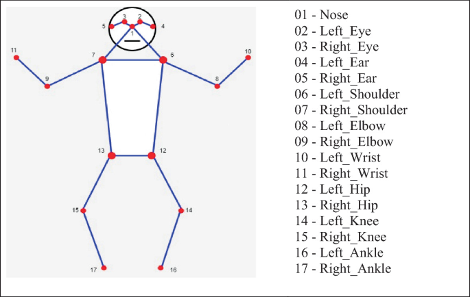
  <p><em>Hình 3: Cấu trúc 33 điểm mốc của MediaPipe Pose (trái) và 17 điểm mốc của MoveNet (phải)</em></p>
</div>

<div align="center">
  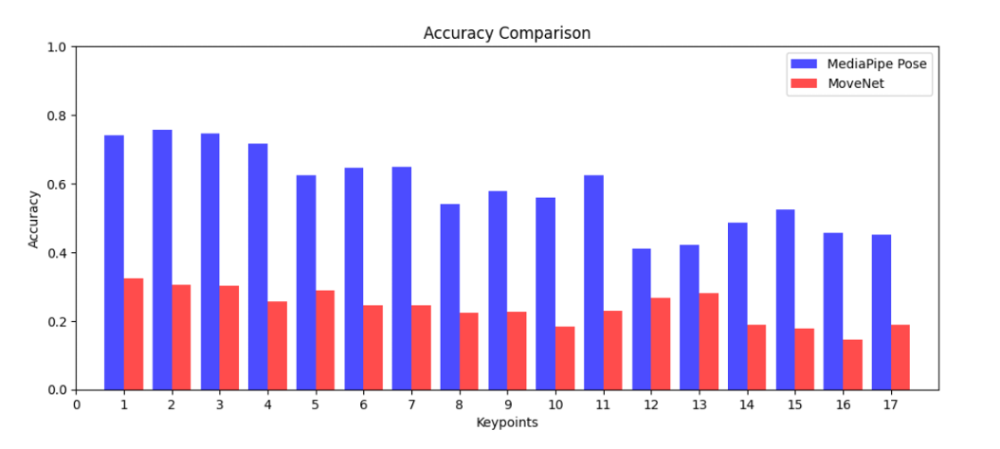
  <p><em>Hình 4: Đánh giá phân bố độ chính xác điểm mốc (PCK) giữa MediaPipe và MoveNet</em></p>
</div>

| Tiêu chí So sánh | Google MediaPipe Pose (Lựa chọn) | MoveNet Lightning |
| :--- | :--- | :--- |
| **Số lượng Điểm mốc (Keypoints)** | **33 điểm** (Bao quát bàn tay, ngón tay, khuôn mặt, thân) | 17 điểm (Chỉ các khớp xương cơ bản) |
| **Không gian Tọa độ** | **3D $(x, y, z)$** với độ sâu tương đối | 2D $(x, y)$ phẳng |
| **Kiến trúc Mạng** | **BlazePose** (Bộ phát hiện Detector + Bộ bám vết Tracker) | MobileNetV2 (Single-shot detector) |
| **Độ chính xác (PCK@0.2)** | **Rất cao ($75\% - 85\%$)** | Trung bình ($< 50\%$) |
| **Độ ổn định & Chống rung** | **Tích hợp bộ lọc One-Euro Filter**, tọa độ mượt mà | Dễ rung lắc (Jitter) khi đứng yên |
| **Tốc độ Xử lý Thực tế** | $\approx 29 - 35\text{ FPS}$ (Đạt chuẩn Real-time) | $\approx 45 - 49\text{ FPS}$ |
| **Xử lý Bị Che khuất (Occlusion)** | **Dự đoán và nội suy vị trí điểm bị che rất tốt** | Dễ mất dấu điểm khớp |

> 🎯 **Kết luận:** **MediaPipe Pose** được chọn làm hạt nhân công nghệ nhờ độ chính xác vượt bậc, khả năng bám vết 33 điểm mốc mượt mà và xử lý che khuất xuất sắc trong không gian phòng ở hẹp.

---

### 2. Thuật toán Tính toán Trọng tâm Cơ thể (Body Center of Gravity)

Để tránh hiện tượng nhân vật di chuyển sai lệch do chuyển động vung tay chân tự nhiên, hệ thống không theo dõi tứ chi mà tính toán **Trọng tâm thân người (Body Center)** dựa trên 4 điểm mốc ổn định nhất:
- Điểm 11: Vai trái (Left Shoulder)
- Điểm 12: Vai phải (Right Shoulder)
- Điểm 23: Hông trái (Left Hip)
- Điểm 24: Hông phải (Right Hip)

<div align="center">
  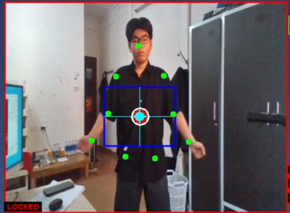
  <p><em>Hình 5: Bốn điểm mốc giải phẫu cốt lõi được sử dụng để xác định trọng tâm $C(x, y)$</em></p>
</div>

**Công thức xác định tọa độ trọng tâm:**

$$C_x = \frac{x_{11} + x_{12} + x_{23} + x_{24}}{4} \times W$$

$$C_y = \frac{y_{11} + y_{12} + y_{23} + y_{24}}{4} \times H$$

*(Trong đó $W, H$ lần lượt là chiều rộng và chiều cao khung hình camera)*

---

### 3. Cơ chế Khóa & Cân chỉnh Ngưỡng Động (Dynamic Threshold Calibration)

Thay vì áp dụng các toạ độ pixel cố định gây lỗi khi người chơi đứng xa/gần hoặc có vóc dáng khác nhau, HAU Active sử dụng **Lưới Ngưỡng Động (Dynamic Threshold Grid)**:

<div align="center">
  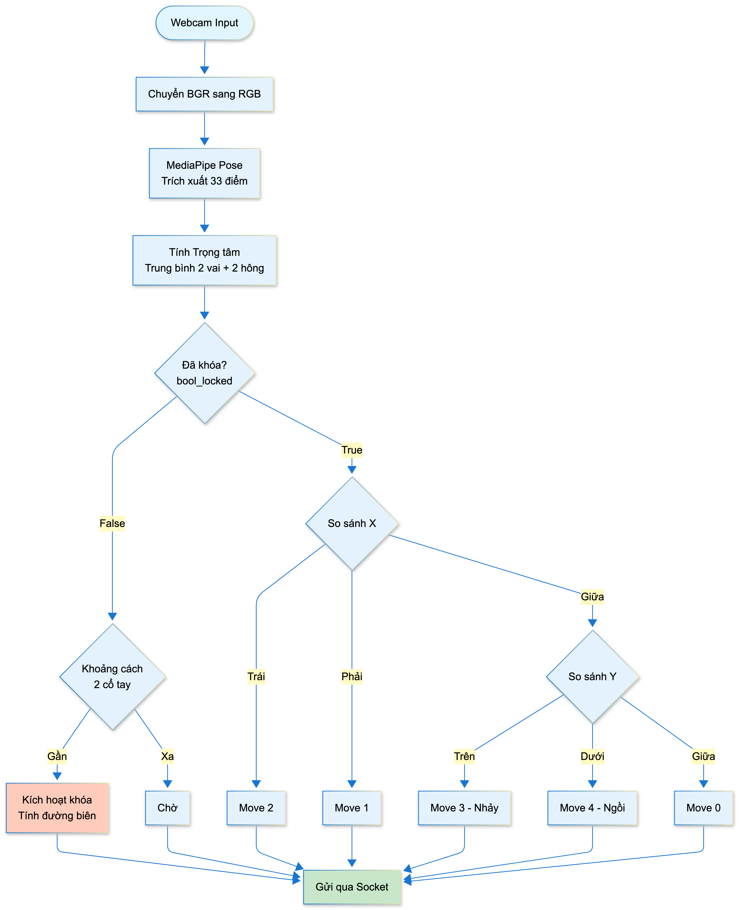
  <p><em>Hình 6: Khung hiển thị OpenCV: Điểm trọng tâm (chấm đỏ), khung ngưỡng động (hộp xanh) và 9 điểm khung xương</em></p>
</div>

1. **Cử chỉ Khóa vị trí (Clap Lock Pose):**
   Người chơi đứng cách webcam $1.5\text{m} - 2\text{m}$ và chắp hai cổ tay lại gần nhau trước ngực. Hệ thống tính khoảng cách Euclid giữa hai cổ tay (Landmark 19 & 20):
   
   $$d = \sqrt{(x_{19} - x_{20})^2 + (y_{19} - y_{20})^2} < \text{threshold\_clap} \quad (0.05)$$

   Khi thỏa mãn liên tiếp 3 khung hình (`clap_confirm_frames = 3`), hệ thống chốt tọa độ khóa `bool_locked = True`.

2. **Công thức thiết lập các đường biên giới hạn ảo:**
   - Biên trái ($L$) và Biên phải ($R$):
     $$L_{\text{fixed}} = x_{11} + (x_{11} - x_{12}) \times \text{threshold\_horizontal}$$
     $$R_{\text{fixed}} = x_{12} - (x_{11} - x_{12}) \times \text{threshold\_horizontal}$$
   - Ngưỡng trên ($U$ - Nhảy) và Ngưỡng dưới ($D$ - Ngồi):
     $$U_{\text{fixed}} = y_{12} - (y_{24} - y_{12}) \times \text{threshold\_vertical}$$
     $$D_{\text{fixed}} = y_{24} + (y_{24} - y_{12}) \times \text{threshold\_vertical}$$

Khi trọng tâm $C(x, y)$ cắt qua các đường biên tương ứng, tín hiệu `Move_Code` được sinh ra ngay lập tức.

---

### 4. Nhận diện Bàn tay & Con trỏ Không chạm (Touchless Hand Tracking)

Để điều hướng Menu, truy cập Shop và chơi mini-game Chém hoa quả, module [`MediaPipe Hands`](file:///c:/Users/minhlong/Desktop/game/hau-active-game/Assets/Scripts/Python-Mediapipe/app/detection.py) nhận diện bàn tay phải của người chơi:

<div align="center">
  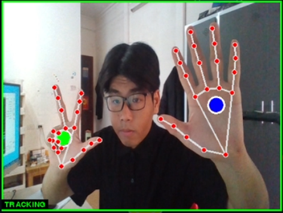
  <p><em>Hình 7: Ba điểm mốc được lấy trung bình để tạo tâm điểm con trỏ chuột mượt mà, chống rung</em></p>
</div>

Tọa độ con trỏ tay được tính từ trung bình cộng của 3 điểm mốc:
- Khớp gốc ngón trỏ (`INDEX_FINGER_MCP`)
- Khớp gốc ngón út (`PINKY_MCP`)
- Khớp cổ tay (`WRIST`)

$$H_x = \frac{x_{\text{index}} + x_{\text{pinky}} + x_{\text{wrist}}}{3} \times W, \quad H_y = \frac{y_{\text{index}} + y_{\text{pinky}} + y_{\text{wrist}}}{3} \times H$$

- **Cơ chế Hover-to-Click:** Khi con trỏ ảo dừng trên một nút bấm UI trong **2.0 giây**, thanh tiến trình tròn (Radial Fill) sẽ hoàn tất và kích hoạt sự kiện Click mà không cần bất kỳ thao tác bấm phím nào.

<div align="center">
  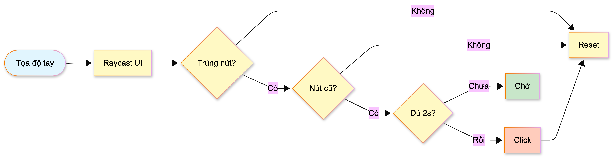
  <p><em>Hình 8: Sơ đồ luồng thuật toán tương tác không chạm (Hover-to-Click)</em></p>
</div>

---

## 🎮 Các Chế độ Chơi (Gameplay Modes)

<div align="center">
  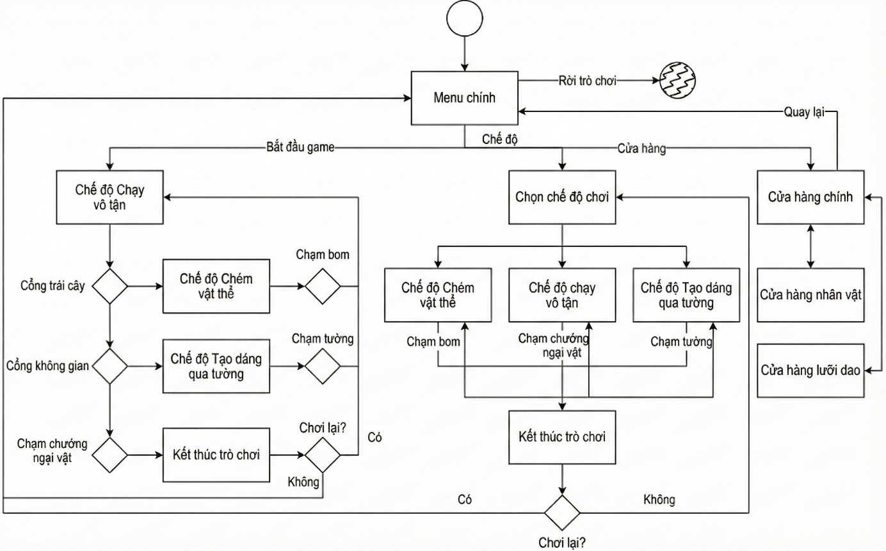
  <p><em>Hình 9: Cấu trúc chuyển đổi linh hoạt giữa màn chơi chính và các mini-game thông qua Cổng Dịch Chuyển</em></p>
</div>

---

### Chế độ 1: Chạy vô tận (Endless Runner - Core Mode)

Chế độ cốt lõi lấy cảm hứng từ *Subway Surfers*, đưa người chơi vào hành lang Khoa CNTT với 3 làn chạy.

<div align="center">
  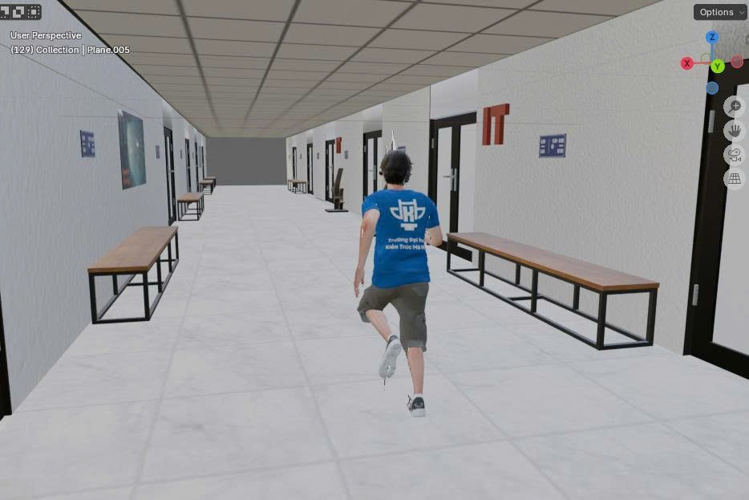
  &nbsp;
  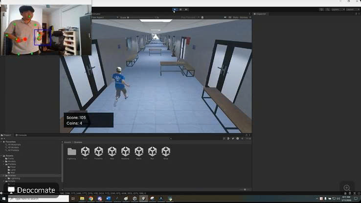
  <p><em>Hình 10: Gameplay Chạy vô tận góc nhìn thứ ba trong hành lang Khoa CNTT - HAU</em></p>
</div>

- **Quy tắc chơi:**
  - Nhân vật tự động chạy về phía trước với tốc độ tăng dần theo thời gian.
  - **Nghiêng người Trái/Phải:** Chuyển đổi giữa 3 làn đường để nhặt đồng xu vàng (**Coins**) và né chướng ngại vật.
  - **Bật Nhảy (Jump):** Vượt qua bàn ghế, rào chắn tầm thấp.
  - **Ngồi Xổm (Squat/Slide):** Trượt người dưới các tủ đồ, biển hiệu tầm cao.
  - **Cổng Dịch Chuyển (Portals):** Xuất hiện ngẫu nhiên trên đường chạy để chuyển cảnh sang các Mini-game.

---

### Chế độ 2: Chém hoa quả (Fruit Slicing Mini-game)

Lấy cảm hứng từ *Fruit Ninja*, kích hoạt khi người chơi chạy vào **Cổng Trái Cây (Fruit Portal)**.

<div align="center">
  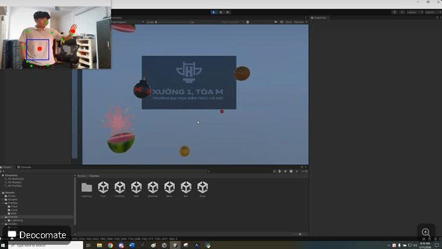
  <p><em>Hình 11: Chế độ Chém hoa quả tương tác bằng vệt dao ảo điều khiển theo chuyển động tay thực</em></p>
</div>

- **Quy tắc chơi:**
  - Vung tay phải nhanh trong không gian thực để điều khiển **Lưỡi dao ảo (Blade Trail)** chém đôi các loại hoa quả (Dưa hấu, Táo, Cam, Lê, Dừa) đang bay lên.
  - Khi chém trúng hoa quả, hiệu ứng phân mảnh vật lý 3D và nước ép bắn tung tóe xuất hiện sinh động.
  - **Cẩn thận với Bom:** Chém trúng bom sẽ phát nổ và kết thúc lượt chơi ngay lập tức.

---

### Chế độ 3: Tạo dáng qua tường (Wall Shape-Fitting Mini-game)

Lấy cảm hứng từ gameshow truyền hình *Hole in the Wall*, kích hoạt khi chạm **Cổng Không Gian (Hole Portal)**.

<div align="center">
  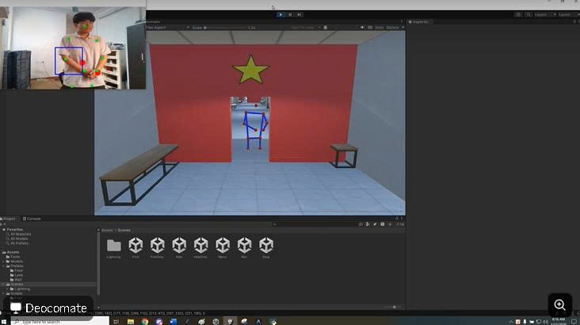
  <p><em>Hình 12: Chế độ Tạo dáng điều chỉnh thân trên lọt qua lỗ hổng trên bức tường đang tiến tới</em></p>
</div>

- **Quy tắc chơi:**
  - Bức tường với các lỗ hổng hình dáng kỳ lạ di chuyển liên tục về phía camera.
  - Người chơi phải nhanh chóng quan sát và uốn nắn tư thế thân trên (dang tay, giơ cao, nghiêng người) sao cho các khớp xương ảo lọt trọn vào khung rỗng.
  - Va chạm với phần tường đặc sẽ khiến nhân vật vấp ngã và kết thúc màn chơi.

---

## 🏛️ Tài nguyên & Môi trường 3D Khoa CNTT HAU

### 1. Tái hiện Giảng đường Khoa CNTT Đại học Kiến trúc Hà Nội

Toàn bộ mô hình môi trường được thiết kế và tối ưu lưới đa giác (Low-Poly Topology) trên **Blender**, sau đó xuất sang chuẩn `.FBX` đưa vào Unity:

<div align="center">
  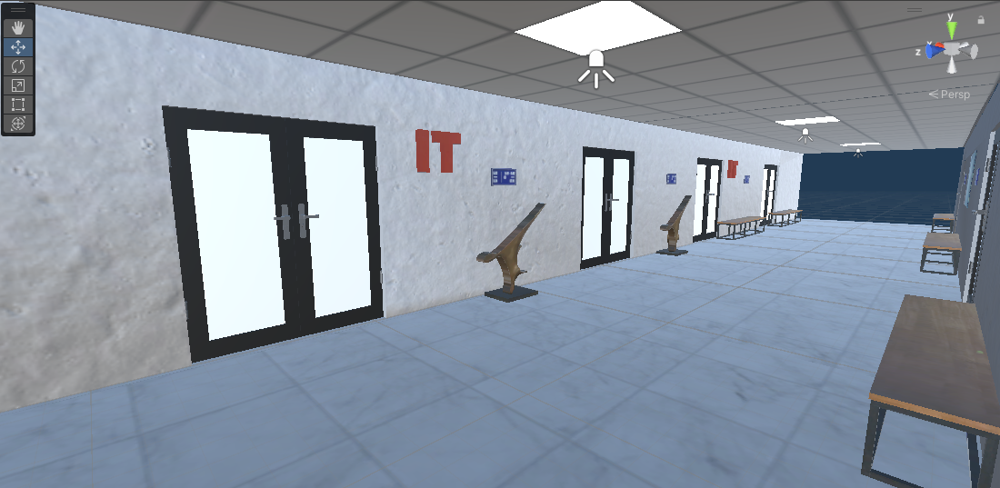
  &nbsp;
  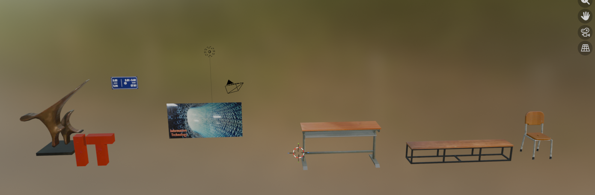
  <p><em>Hình 13: Phối cảnh 3D hành lang Khoa CNTT, biểu tượng logo IT đỏ và bảng tên phòng học quen thuộc</em></p>
</div>

- Tái hiện chân thực: Bảng hiệu giảng đường phòng 501, 502, 503, logo IT điêu khắc nổi, tranh cổ động CNTT, bàn ghế gỗ sinh viên.
- Hệ thống chiếu sáng: Áp dụng kỹ thuật **Baked Global Illumination** để tối ưu hóa hiệu năng render, tạo bóng đổ chân thực nhưng không tiêu tốn GPU thời gian thực.

---

### 2. Thuật toán Sinh màn chơi Thủ tục & Quản lý Bộ nhớ (Procedural Generation & Pooling)

Để đảm bảo đường chạy kéo dài vô tận mà không gây tràn bộ nhớ RAM:

<div align="center">
  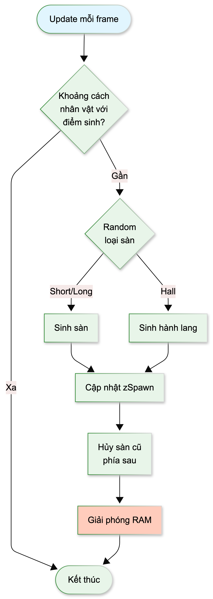
  <p><em>Hình 14: Sơ đồ giải thuật sinh môi trường ngẫu nhiên và tái chế tài nguyên sàn chạy</em></p>
</div>

- **Mô-đun hóa Sàn chạy (`FloorManager.cs`, `TileManager.cs`):**
  - Khối sàn ngắn (`shortFloorPrefabs`): chiều dài 97 đơn vị
  - Khối sàn dài (`longFloorPrefabs`): chiều dài 105 đơn vị
  - Khối hành lang (`hallwayPrefabs`): chiều dài 74 đơn vị
- **Cơ chế Tái chế Đối tượng (Object Recycling / Pooling):** Khi nhân vật vượt qua một đoạn sàn quá $120\text{ units}$, đoạn sàn phía sau sẽ tự động được thu hồi và tái sử dụng ở phía trước, giúp dung lượng RAM luôn ổn định dưới $350\text{ MB}$.

---

### 3. Hệ thống Vật thể Tương tác & Chướng ngại vật

<div align="center">
  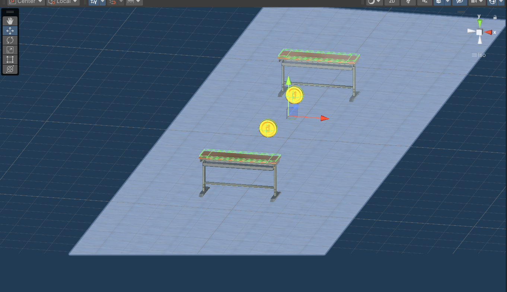
  <p><em>Hình 15: Các mô-đun chướng ngại vật và vật phẩm tương tác trong game</em></p>
</div>

| Vật thể / Prefab | Phân loại | Hành vi Kỹ thuật | Yêu cầu Vận động |
| :--- | :--- | :--- | :--- |
| **Bàn học, Ghế dài (Floor Obstacle)** | Chướng ngại vật thấp | Box Collider va chạm gọi `GameOver()` | **Bật Nhảy (Jump)** |
| **Tủ đồ, Biển phòng (High Obstacle)** | Chướng ngại vật cao | Treo lơ lửng, va chạm khi đứng thẳng | **Ngồi Xổm (Squat/Slide)** |
| **Đồng Tiền Vàng (Gold Coin)** | Vật phẩm tích lũy | `transform.Rotate()`, tăng quỹ Coins | **Chuyển làn Trái/Phải** |
| **Cổng Trái Cây (Fruit Portal)** | Cổng dịch chuyển | Kích hoạt chuyển cảnh sang Scene `Fruit` | Thử thách phản xạ tay |
| **Cổng Không Gian (Hole Portal)** | Cổng dịch chuyển | Kích hoạt chuyển cảnh sang Scene `Hole` | Thử thách tạo dáng thân trên |
| **Trái Cây & Bom (Fruit/Bomb)** | Mục tiêu tương tác | Rigidbody ném lên, cắt bằng Collider `Blade` | Chém hoa quả, né bom |

---

## 🖥️ Giao diện Người dùng Không chạm (Touchless UI/UX)

<div align="center">
  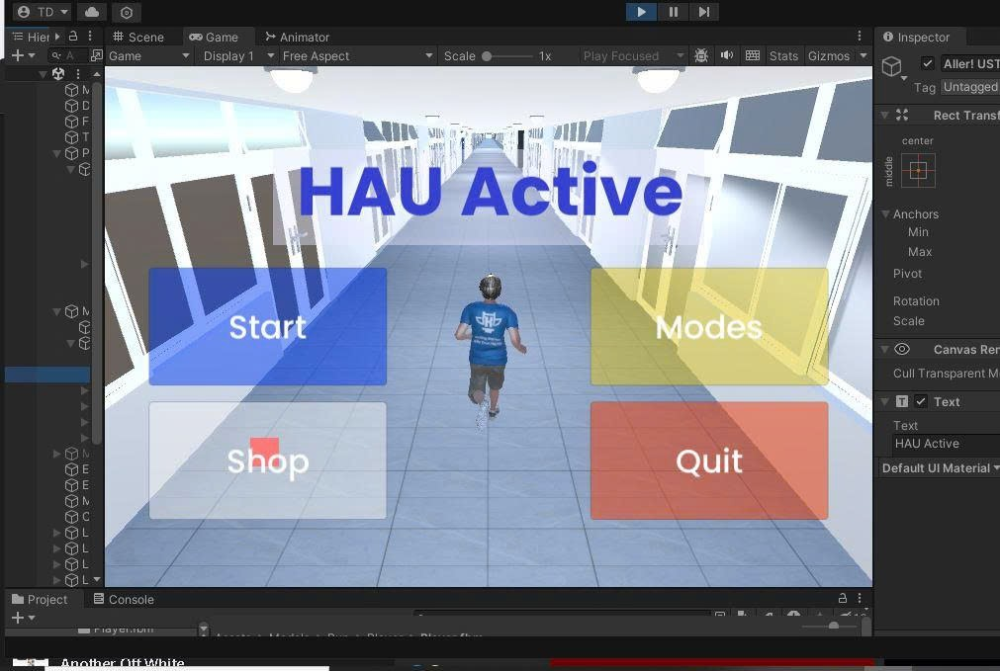
  <p><em>Hình 16: Màn hình chính với nhân vật 3D phản chiếu chuyển động thực tế và các nút điều hướng lớn</em></p>
</div>

- **Thiết kế Nút bấm Lớn:** Các nút **Start**, **Modes**, **Shop**, **Quit** được bố trí trực quan, khoảng cách rộng rãi, tối ưu cho việc điều khiển bằng con trỏ tay từ xa ($2\text{m}$).
- **Visual Feedback Thời gian thực:** Nhân vật 3D ở Menu tự động mô phỏng theo chuyển động của người chơi để kiểm tra độ nhạy camera trước khi bắt đầu.
- **Lưu trữ Cục bộ (`PlayerPrefs`):** Tự động lưu trữ điểm cao nhất (**High Score**) và số tiền vàng tích lũy (**Coins**).

---

## 🚀 Hướng dẫn Cài đặt & Khởi chạy

### Yêu cầu Hệ thống

| Thành phần | Cấu hình Tối thiểu (Laptop văn phòng) | Cấu hình Khuyến nghị (Gaming/Workstation) |
| :--- | :--- | :--- |
| **Hệ điều hành** | Windows 10/11 64-bit | Windows 10/11 64-bit |
| **Bộ vi xử lý (CPU)** | Intel Core i5 Gen 8 / AMD Ryzen 3 | Intel Core i7 Gen 10+ / AMD Ryzen 5 4000+ |
| **Card đồ họa (GPU)** | Intel UHD Graphics 620 | NVIDIA GTX 1050 / GTX 1650 trở lên |
| **Bộ nhớ RAM** | 4 GB | 8 GB - 16 GB |
| **Ổ cứng** | 2 GB dung lượng trống | 4 GB SSD |
| **Webcam** | Camera tích hợp 720p 30fps | Webcam HD rời 1080p 60fps |
| **Không gian chơi** | Tối thiểu $1.5\text{m}$ phía trước camera, đủ sáng | $2.0\text{m} - 2.5\text{m}$, ánh sáng đồng đều |

---

### Bước 1: Cài đặt & Chạy Python AI Backend

1. Mở cửa sổ Terminal / PowerShell tại thư mục `Assets/Scripts/Python-Mediapipe`:
   ```bash
   cd "c:\Users\minhlong\Desktop\game\hau-active-game\Assets\Scripts\Python-Mediapipe"
   ```

2. Tạo và kích hoạt môi trường ảo Python (khuyên dùng Python 3.8 đến 3.12):
   ```bash
   python -m venv venv
   
   # Trên Windows PowerShell:
   .\venv\Scripts\Activate.ps1
   # Hoặc trên Command Prompt (cmd):
   .\venv\Scripts\activate.bat
   ```

3. Cài đặt các thư viện phụ thuộc:
   ```bash
   pip install -r requirements.txt
   ```
   *(Các thư viện chính: `mediapipe`, `opencv-python`, `numpy`)*

4. Khởi chạy Server Thị giác máy tính:
   ```bash
   python main.py
   ```
   *Màn hình Console sẽ thông báo:*
   ```text
   [MediaPipe] Server started on 127.0.0.1:5052
   Waiting for Unity connection...
   ```

---

### Bước 2: Mở & Chạy Unity Frontend

1. Khởi động **Unity Hub** và chọn phiên bản **Unity 2020.3 LTS** hoặc **Unity 2021.3+ LTS**.
2. Nhấn **Open** $\rightarrow$ Trỏ tới thư mục gốc dự án: `c:\Users\minhlong\Desktop\game\hau-active-game`.
3. Trong cửa sổ **Project**, mở Scene chính:
   `Assets/Scenes/Menu.unity`
4. Nhấn nút **Play ▶️** ở trên cùng Unity Editor.
5. Kiểm tra cửa sổ Console: Unity sẽ in ra thông báo `Connected to the server.`.

---

### Bước 3: Cân chỉnh Tư thế Khởi động (Calibration)

1. Đứng cách webcam khoảng **$1.5\text{m} - 2.0\text{m}$**, đảm bảo camera quan sát rõ từ đầu đến ngang đùi.
2. Di chuyển bàn tay phải để điều khiển con trỏ màu đỏ trên màn hình. Giữ con trỏ trên nút **START** trong **2 giây** để vào game.
3. Khi vào đường chạy, thực hiện **Cử chỉ Khóa (Clap Gesture)**: Chắp hai tay trước ngực.
4. Màn hình Python sẽ hiển thị dòng chữ `locked - position reset`, khung nhận diện chuyển sang màu xanh lá/đỏ và nhân vật bắt đầu chạy!

---

## 🕹️ Bảng Điều khiển & Thao tác Vận động

<div align="center">
  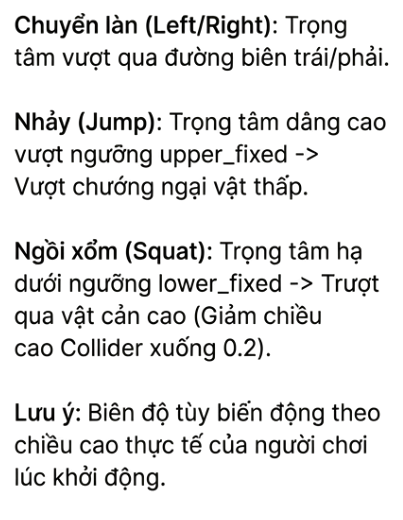
  <p><em>Hình 17: Quy tắc chuyển đổi cử chỉ thể chất thực tế thành lệnh điều khiển nhân vật ảo</em></p>
</div>

| Thao tác Cơ thể Thực tế | Hành động của Nhân vật Trong Game | Tác dụng Luyện tập |
| :--- | :--- | :--- |
| 👏 **Chắp hai tay trước ngực (Clap)** | Khóa vị trí ban đầu & Bắt đầu chạy | Cân chỉnh tỷ lệ cơ thể |
| 🏃‍♂️ **Chạy tại chỗ / Đứng thẳng** | Nhân vật chạy thẳng về phía trước | Cardio nhẹ nhàng |
| 🥾 **Nghiêng người / Bước sang Trái** | Chuyển sang làn chạy bên trái | Rèn luyện cơ liên sườn |
| 🥾 **Nghiêng người / Bước sang Phải** | Chuyển sang làn chạy bên phải | Rèn luyện cơ liên sườn |
| 🦘 **Bật Nhảy cao (Jump)** | Nhảy vượt rào chắn / bàn học thấp | Phát triển cơ đùi & bắp chân (Jump Squat) |
| 🧘‍♂️ **Ngồi Xổm sâu (Squat / Crouch)** | Trượt người dưới tủ đồ / vật cản cao | Rèn luyện cơ mông, đùi trước (Deep Squat) |
| 🖐️ **Vung tay phải tự do** | Chém đôi trái cây trong Mini-game | Tăng cường phản xạ & cơ vai, cánh tay |
| 🙆‍♂️ **Tạo dáng thân trên (Pose)** | Uốn người qua lỗ hổng tường | Tăng độ dẻo dai cơ thể |

---

## 📊 Kết quả Thực nghiệm & Đánh giá

### 1. Hiệu năng Kỹ thuật & Độ trễ (FPS & Latency)

Đồ án được kiểm thử toàn diện trên 2 cấu hình phần cứng đại diện:

| Tiêu chí Đánh giá | Cấu hình 1: Laptop Văn phòng (Intel Core i5-8250U, UHD 620) | Cấu hình 2: Gaming Laptop (AMD Ryzen 5 5600H, GTX 1650) |
| :--- | :--- | :--- |
| **FPS Xử lý AI (Python)** | $18 - 24\text{ FPS}$ | **$30 - 35\text{ FPS}$** (Giới hạn tối đa của Webcam) |
| **FPS Render Game (Unity)** | $40 - 50\text{ FPS}$ | **$60\text{ FPS}$** (V-Sync mượt mà) |
| **Độ trễ Toàn trình (Latency)** | $\approx 55 - 70\text{ ms}$ (Có thể chơi tốt) | **$\approx 30 - 40\text{ ms}$** (Phản hồi tức thì) |
| **Băng thông Truyền tin TCP** | $< 0.1\text{ MB/s}$ | $< 0.1\text{ MB/s}$ |
| **Đánh giá Trải nghiệm** | Mượt mà nhờ thuật toán nội suy `Vector3.Lerp` | Trải nghiệm hoàn hảo, không có độ trễ cảm nhận |

---

### 2. Hiệu quả Đốt cháy Năng lượng (Caloric & METs Analysis)

Dựa trên chuẩn y khoa quốc tế về chuyển hóa năng lượng (**METs - Metabolic Equivalent of Task**):

<div align="center">

```text
Chơi game tĩnh tại thông thường:    █ 1.5 METs
HAU Active (Chạy + Nhảy + Squat):  ████████████ 4.0 - 6.0 METs (Gấp 3 - 4 lần!)
Đi bộ nhanh / Aerobic nhẹ tại nhà: ███████████ 4.5 - 5.5 METs
```

</div>

- **Mức tiêu hao Calo:** 15 phút trải nghiệm HAU Active liên tục giúp tiêu thụ khoảng **$80 - 120\text{ kcal}$**, tương đương với 15 phút đi bộ nhanh hoặc tập thể dục nhịp điệu.
- **Lợi ích Sức khỏe:** Kích thích tuần hoàn máu, giảm đau mỏi vai gáy do ngồi học nhiều, giải tỏa stress sau những giờ lập trình căng thẳng.

---

### 3. Đánh giá Trải nghiệm Người dùng (Beta Testing Survey)

Thử nghiệm thực tế trên nhóm mẫu gồm **20 sinh viên Khoa CNTT - Trường ĐH Kiến trúc Hà Nội**:

<div align="center">
  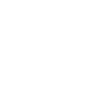
  <p><em>Hình 18: Biểu đồ chỉ số hài lòng và hiệu năng đánh giá tổng kết từ sinh viên HAU</em></p>
</div>

- ⭐ **4.2 / 5.0 Điểm hài lòng tổng thể:** Hơn **85% sinh viên** đánh giá cao tính sáng tạo và cảm giác mới lạ của cơ chế điều khiển không chạm.
- 🎯 **80% Đánh giá Thao tác Chính xác:** Cơ chế Ngưỡng động thích ứng tốt với các thể trạng chiều cao khác nhau.
- 💡 **Ý kiến đóng góp:** Đề xuất rút ngắn thời gian Hover Click và mở rộng thêm tính năng thi đấu Online nhiều người chơi (Multiplayer).

---

## 🎥 Video Demo Thực tế

Dự án cung cấp đầy đủ video ghi hình thực tế trong thư mục [`Docs/Video Demo`](file:///c:/Users/minhlong/Desktop/game/hau-active-game/Docs/Video%20Demo):

1. **[Demo full.mp4](file:///c:/Users/minhlong/Desktop/game/hau-active-game/Docs/Video%20Demo/Demo%20full.mp4):** Toàn bộ quy trình trải nghiệm từ Menu, chạy vô tận, chuyển cảnh sang các mini-game và Game Over.
2. **[Demo chế độ chạy vô tận + đi xuyên tường.mp4](file:///c:/Users/minhlong/Desktop/game/hau-active-game/Docs/Video%20Demo/Demo%20chế%20độ%20chạy%20vô%20tận%20+%20đi%20xuyên%20tường.mp4):** Chi tiết vận động né chướng ngại vật và tạo dáng khớp hình cắt trên tường.
3. **[Demo chế độ chém hoa quả.mp4](file:///c:/Users/minhlong/Desktop/game/hau-active-game/Docs/Video%20Demo/Demo%20chế%20độ%20chém%20hoa%20quả.mp4):** Cận cảnh phản xạ chém hoa quả và hiệu ứng phân mảnh 3D.
4. **[Hướng dẫn chạy chương trình.mp4](file:///c:/Users/minhlong/Desktop/game/hau-active-game/Docs/Video%20Demo/Hướng%20dẫn%20chạy%20chương%20trình.mp4):** Video từng bước thiết lập môi trường Python, mở Unity và cân chỉnh camera.

---

## 📁 Cấu trúc Thư mục Dự án

```text
hau-active-game/
├── Assets/
│   ├── Fonts/                      # Phông chữ UI thiết kế
│   ├── Models/                     # Mô hình 3D xuất từ Blender (.fbx, textures)
│   │   ├── Fruit/                  # Models hoa quả, mảnh cắt & quả bom
│   │   ├── Hole/                   # Bức tường khoét lỗ tạo dáng
│   │   └── Run/                    # Mô hình nhân vật Remy, sàn nhà, bàn ghế, logo IT
│   ├── Prefabs/                    # Prefabs hành lang lắp ghép & chướng ngại vật
│   ├── Scenes/                     # Các màn chơi Unity (.unity)
│   │   ├── Menu.unity              # Màn hình chính điều khiển không chạm
│   │   ├── Run.unity               # Màn chơi Chạy vô tận (Core Game)
│   │   ├── Fruit.unity             # Mini-game Chém hoa quả
│   │   ├── Hole.unity              # Mini-game Tạo dáng qua tường
│   │   └── Shop.unity              # Giao diện Cửa hàng
│   └── Scripts/                    # Mã nguồn logic trò chơi C# & Backend Python
│       ├── Fruit/                  # Blade.cs, Fruits.cs, BombScript.cs, FruitGameManager.cs
│       ├── Hole/                   # Wall.cs, WallSpawner.cs, PoseTracking.cs
│       ├── Menu&Shop/              # MainMenuManager.cs, ShopManager.cs, RotateModel.cs
│       ├── Run/                    # PlayerController.cs, FloorManager.cs, Coin.cs, Portal.cs
│       ├── CursorController.cs     # Điều khiển con trỏ bàn tay & cơ chế Hover Click
│       ├── SocketClient.cs         # TCP/UDP Socket Client tiếp nhận dữ liệu
│       └── Python-Mediapipe/       # Backend AI Xử lý Thị giác máy tính
│           ├── app/
│           │   ├── config.py       # Thiết lập ngưỡng nhạy & Cổng Port 5052
│           │   ├── detection.py    # Xử lý MediaPipe Pose & Hands, tính trọng tâm
│           │   ├── main.py         # Socket Server phát stream dữ liệu
│           │   └── window_manager.py
│           ├── main.py             # File khởi động chính
│           └── requirements.txt    # Danh sách thư viện Python cần cài đặt
├── Docs/                           # Tài liệu Đồ án Tốt nghiệp & Tài nguyên truyền thông
│   ├── assets/                     # Kho hình ảnh sơ đồ, biểu đồ & screenshots
│   ├── Video Demo/                 # 4 Video demo gameplay & hướng dẫn chạy
│   ├── 2155010151_Nguyễn Vũ Minh Long_21CN1_101125.pdf    # Thuyết minh Đồ án chi tiết
│   ├── Bản tóm tắt_2155010151_Nguyễn Vũ Minh Long_21CN1_101125.pdf # Bản tóm tắt
│   └── Slide.pptx                  # Slide báo cáo bảo vệ Đồ án
├── ProjectSettings/                # Thiết lập cấu hình Unity Engine
├── README.md                       # Tài liệu hướng dẫn trực quan (File này)
└── .gitignore
```

---

## 🛠️ Xử lý Sự cố Thường gặp (Troubleshooting)

| Hiện tượng lỗi | Nguyên nhân khả dĩ | Hướng dẫn khắc phục |
| :--- | :--- | :--- |
| **Unity Console báo `Socket error: Connection refused`** | Chưa bật Python backend trước khi bấm Play trong Unity. | Chạy lệnh `python main.py` trong thư mục `Python-Mediapipe` trước khi nhấn Play trong Unity. |
| **Nhân vật không di chuyển / Không nhận diện được tư thế** | Đứng quá gần camera ($< 1\text{m}$) hoặc ánh sáng quá tối / ngược sáng. | Đứng lùi ra xa $1.5\text{m} - 2.0\text{m}$, bật đèn phòng sáng rõ và thực hiện lại cử chỉ chắp tay (Clap) để khóa vị trí. |
| **Con trỏ tay bị rung lắc liên tục trên Menu** | Bàn tay bị che khuất hoặc camera bị mờ, nhiễu hạt. | Giơ rõ lòng bàn tay phải về phía camera, lau sạch ống kính webcam và giữ yên tay khi cần chọn nút. |
| **FPS bị tụt thấp ($< 20\text{ FPS}$)** | Máy tính đang chạy các ứng dụng nặng khác chạy ngầm. | Đóng bớt các phần mềm đồ họa nặng, giảm độ phân giải webcam trong `main.py` về `640x480`. |
| **Tường lửa Windows Firewall chặn kết nối** | Port 5052 chưa được cấp quyền qua Firewall. | Cho phép Python và Unity truy cập qua Private Network trong Windows Defender Firewall. |

---

## 👨‍💻 Thông tin Đồ án & Tác giả

*Đồ án Tốt nghiệp Kỹ sư ngành Công nghệ Thông tin - Khóa 2021 – 2026*  
**Khoa Công nghệ Thông tin — Trường Đại học Kiến trúc Hà Nội (HAU)**

- 🎓 **Sinh viên thực hiện:** **Nguyễn Vũ Minh Long** (Lớp 2021CN1 - Mã SV: 2155010151)
- 👨‍🏫 **Giảng viên hướng dẫn:** **ThS. Nguyễn Quốc Huy**
- 🏫 **Đơn vị:** Khoa Công nghệ Thông tin, Trường Đại học Kiến trúc Hà Nội, Km10 Đường Nguyễn Trãi, Thanh Xuân, Hà Nội.

---

<div align="center">

⭐ **HAU Active — Chuyển hóa Giờ Giải trí Thụ động thành Động lực Rèn luyện Thể chất Đỉnh cao!** ⭐

</div>
