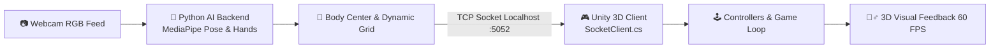

# 🏃‍♂️ HAU Active: Game Vận Động Tương Tác Không Chạm (Exergame)

<div align="center">


**Ứng dụng Thị giác Máy tính (Computer Vision) & AI Nhận diện Tư thế Thời gian thực để Điều khiển Nhân vật Game trên Unity 3D**

[](https://unity.com/)
[](https://www.python.org/)
[](https://developers.google.com/mediapipe)
[](https://opencv.org/)
[](https://www.blender.org/)
[](#-thông-tin-đồ-án--tác-giả)

[📖 Giới thiệu](#-tổng-quan-dự-án) •
[⚙️ Kiến trúc](#️-kiến-trúc-hệ-thống) •
[🧠 Giải thuật AI](#-thuật-toán-thị-giác-máy-tính--ai) •
[🎮 Gameplay](#-các-chế-độ-chơi) •
[🚀 Cài đặt & Chạy](#-hướng-dẫn-cài-đặt--khởi-chạy) •
[📊 Đánh giá](#-kết-quả-thực-nghiệm) •
[🎥 Demo](#-video-demo-thực-tế)

</div>

---

## 📖 Tổng quan Dự án

**HAU Active** là tựa game vận động thể chất tương tác (**Exergame**) được phát triển nhằm giải quyết lối sống tĩnh tại và thói quen ngồi máy tính kéo dài của sinh viên CNTT. Dự án kết hợp công nghệ **Thị giác máy tính (Google MediaPipe BlazePose & Hands)** trên nền Python với môi trường đồ họa **Unity 3D**, cho phép người chơi điều khiển game hoàn toàn bằng cử chỉ cơ thể thời gian thực qua webcam thông thường mà không cần bất kỳ cảm biến hay thiết bị đeo đắt tiền nào.

<div align="center">
  
</div>

### 🌟 Điểm Nổi Bật
- **Hoàn toàn Không chạm (Zero-Touch):** Nhận diện 33 điểm mốc cơ thể và 21 điểm mốc bàn tay để điều hướng menu và điều khiển nhân vật.
- **Tận dụng Webcam Phổ thông:** Tương thích tốt với webcam laptop 720p/1080p, không đòi hỏi phần cứng chuyên dụng (Kinect, cảm biến hồng ngoại).
- **Bản địa hóa Giảng đường HAU:** Tái hiện chi tiết hành lang Khoa CNTT - Đại học Kiến trúc Hà Nội dưới dạng không gian 3D tối ưu đồ họa (Baked GI, Low-poly).
- **Hệ thống Đa Chế độ (3-in-1):** Tích hợp Chạy vô tận né chướng ngại vật, Chém hoa quả phản xạ tay và Tạo dáng qua tường rỗng.
- **Độ trễ Siêu Thấp:** Giao tiếp TCP Socket đa luồng non-blocking nội bộ với độ trễ phản hồi chỉ **30 – 40 ms**.

---

## ⚙️ Kiến trúc Hệ thống

Hệ thống hoạt động theo mô hình **Client-Server phân tán cục bộ (Local Distributed Architecture)**: tiến trình Python đảm nhiệm xử lý thị giác máy tính nặng, truyền dữ liệu tọa độ qua **TCP Socket (Port 5052)** sang tiến trình Unity 3D để render đồ họa 60 FPS mượt mà.



### 📦 Giao thức Gói tin (Packet Protocol)
Dữ liệu gửi từ Python sang Unity được đóng gói dưới dạng chuỗi văn bản ASCII tối giản:

```text
"[FullBody Landmarks], (Hand_X, Hand_Y), (Center_X, Center_Y), Move_Code"
```

| Trường Dữ liệu | Định dạng | Mô tả chức năng |
| :--- | :--- | :--- |
| `FullBody Landmarks` | `[[x1,y1], ...]` | 33 điểm mốc khung xương (phục vụ chế độ Tạo dáng tường) |
| `(Hand_X, Hand_Y)` | `(int, int)` | Tọa độ trọng tâm bàn tay phải (con trỏ chuột & vệt chém dao) |
| `(Center_X, Center_Y)` | `(int, int)` | Tọa độ trọng tâm thân trên của người chơi |
| `Move_Code` | `int (0 - 5)` | `0`: Idle \| `1`: Right \| `2`: Left \| `3`: Jump \| `4`: Crouch \| `5`: Clap Lock |

> 📘 *Chi tiết kiến trúc:* Xem thêm tại [Docs/SYSTEM_ARCHITECTURE.md](Docs/SYSTEM_ARCHITECTURE.md).

---

## 🧠 Thuật toán Thị giác Máy tính & AI

<div align="center">
  
  &nbsp;&nbsp;&nbsp;&nbsp;
  
</div>

### 1. Thuật toán Trọng tâm Cơ thể (Body Center)
Để tránh nhiễu do cử động tay chân khi chạy tại chỗ, vị trí trọng tâm thân người $C(C_x, C_y)$ được tính từ trung bình cộng 4 điểm mốc ổn định nhất (Khớp vai 11, 12 và Khớp hông 23, 24):

$$C_x = \frac{x_{11} + x_{12} + x_{23} + x_{24}}{4} \times W, \quad C_y = \frac{y_{11} + y_{12} + y_{23} + y_{24}}{4} \times H$$

### 2. Cân chỉnh Ngưỡng Động & Cử chỉ Khóa (Clap Lock)
- **Cử chỉ Khóa (Clap Lock):** Người chơi chắp 2 cổ tay trước ngực. Khi khoảng cách Euclid giữa 2 cổ tay $d = \sqrt{(x_{19} - x_{20})^2 + (y_{19} - y_{20})^2} < 0.05$ trong 3 khung hình liên tiếp, hệ thống khóa tọa độ gốc ban đầu (`bool_locked = True`).
- **Lưới Ngưỡng Động (Dynamic Grid):** Tự động co giãn theo chiều cao và độ rộng vai của từng người chơi, giúp game nhận diện chính xác dù người chơi cao hay thấp, đứng gần hay xa ($1.5\text{m} - 2.5\text{m}$).

### 3. Con trỏ Bàn tay & Tương tác Không chạm (Hover-to-Click)
- Tọa độ con trỏ tay được tính từ trung bình của 3 điểm: Khớp ngón trỏ (`INDEX_FINGER_MCP`), Khớp ngón út (`PINKY_MCP`) và Cổ tay (`WRIST`).
- **Cơ chế Hover-to-Click:** Khi con trỏ dừng trên một nút bấm UI đủ **2.0 giây**, vòng tròn tiến trình (Radial Fill) sẽ kích hoạt sự kiện Click tự động.

> 📘 *Chi tiết giải thuật toán học:* Xem thêm tại [Docs/ALGORITHMS.md](Docs/ALGORITHMS.md).

---

## 🎮 Các Chế độ Chơi

<div align="center">
  
</div>

| Chế độ | Minh họa | Luật chơi & Yêu cầu vận động |
| :--- | :---: | :--- |
| **1. Chạy Vô Tận**<br/>*(Endless Runner)* |  | - Tự động chạy trong hành lang Khoa CNTT - HAU.<br/>- **Nghiêng Trái/Phải:** Chuyển 3 làn nhặt Coin & né vật cản.<br/>- **Bật Nhảy (Jump):** Vượt qua bàn ghế, chướng ngại vật thấp.<br/>- **Ngồi Xổm (Squat):** Trượt dưới tủ đồ, biển hiệu phòng học.<br/>- **Cổng Dịch Chuyển:** Chuyển tiếp tức thì sang các Mini-game. |
| **2. Chém Hoa Quả**<br/>*(Fruit Slicing)* |  | - Kích hoạt khi chạy vào **Fruit Portal**.<br/>- Vung tay phải nhanh trong không gian thực để điều khiển vệt dao cắt hoa quả 3D.<br/>- Tránh chém trúng bom để không bị Game Over. |
| **3. Tạo Dáng Qua Tường**<br/>*(Wall Shape-Fit)* |  | - Kích hoạt khi chạy vào **Hole Portal**.<br/>- Quan sát lỗ hổng trên bức tường đang tiến tới và uốn nắn tư thế thân trên sao cho khớp hoàn hảo với khung rỗng. |

> 📘 *Chi tiết cẩm nang chơi game:* Xem thêm tại [Docs/GAMEPLAY_GUIDE.md](Docs/GAMEPLAY_GUIDE.md).

---

## 🕹️ Bảng Thao tác Vận động

<div align="center">
  
</div>

| Động tác Thực tế | Hành động Trong Game | Tác dụng Luyện tập |
| :--- | :--- | :--- |
| 👏 **Chắp hai tay trước ngực (Clap)** | Khóa vị trí ban đầu & Bắt đầu chạy | Cân chỉnh tỷ lệ cơ thể |
| 🏃‍♂️ **Chạy tại chỗ / Đứng thẳng** | Chạy thẳng về phía trước | Cardio nhẹ nhàng |
| 🥾 **Nghiêng người sang Trái / Phải** | Đổi làn chạy Trái / Phải | Cơ liên sườn & phản xạ thăng bằng |
| 🦘 **Bật Nhảy cao (Jump)** | Nhảy vượt bàn học / rào chắn thấp | Phát triển cơ đùi & bắp chân (Jump Squat) |
| 🧘‍♂️ **Ngồi Xổm sâu (Squat / Crouch)** | Trượt người dưới chướng ngại vật cao | Rèn luyện cơ mông, đùi trước (Deep Squat) |
| 🖐️ **Vung tay phải tự do** | Chém đôi trái cây trong Mini-game | Cơ vai, cánh tay & tốc độ phản xạ |
| 🙆‍♂️ **Tạo dáng thân trên (Pose)** | Uốn người qua khung tường rỗng | Tăng độ dẻo dai toàn thân |

---

## 🚀 Hướng dẫn Cài đặt & Khởi chạy

### 📋 Yêu cầu Cấu hình
- **HĐH:** Windows 10/11 64-bit.
- **Python:** Phiên bản 3.8 – 3.12.
- **Unity:** Unity 2020.3 LTS hoặc Unity 2021.3+ LTS.
- **Webcam:** Webcam tích hợp hoặc USB 720p/1080p (khoảng cách chơi $1.5\text{m} - 2.5\text{m}$).

---

### Bước 1: Khởi chạy Python AI Backend
Mở Terminal/PowerShell tại thư mục `Assets/Scripts/Python-Mediapipe`:
```bash
cd "Assets/Scripts/Python-Mediapipe"

# Tạo và kích hoạt môi trường ảo
python -m venv venv
.\venv\Scripts\Activate.ps1   # Trên PowerShell (hoặc .\venv\Scripts\activate.bat trên CMD)

# Cài đặt thư viện phụ thuộc
pip install -r requirements.txt

# Khởi chạy AI Server
python main.py
```
*Màn hình Console hiển thị:* `[MediaPipe] Server started on 127.0.0.1:5052. Waiting for Unity connection...`

### Bước 2: Khởi chạy Unity Frontend
1. Mở **Unity Hub** $\rightarrow$ Chọn **Open** $\rightarrow$ Trỏ tới thư mục dự án `hau-active-game`.
2. Mở Scene khởi đầu: `Assets/Scenes/Menu.unity`.
3. Nhấn nút **Play ▶️** trên thanh công cụ của Unity Editor.

### Bước 3: Cân chỉnh & Trải nghiệm
1. Đứng cách webcam khoảng **1.5m – 2.0m**, giơ bàn tay phải điều khiển con trỏ giữ trên nút **START** 2 giây.
2. Khi vào đường chạy, thực hiện **Cử chỉ Chắp tay (Clap)** trước ngực để khóa vị trí ban đầu và bắt đầu vận động!

---

## 📊 Kết quả Thực nghiệm

<div align="center">
  
</div>

### 1. Hiệu năng Kỹ thuật
- **Tốc độ Xử lý AI (Python):** 30 – 35 FPS (tận dụng tối đa tốc độ quét webcam).
- **Tốc độ Khung hình Game (Unity):** 60 FPS (V-Sync mượt mà).
- **Độ trễ Toàn trình (Latency):** **30 – 40 ms** (không có cảm giác trễ thao tác).
- **Tiêu thụ Bộ nhớ RAM:** Luôn ổn định dưới **350 MB** nhờ cơ chế Object Pooling tái chế sàn chạy.

### 2. Tiêu hao Năng lượng Thể chất (METs Analysis)
- Cường độ vận động đạt **4.0 – 6.0 METs** (cao gấp **3 – 4 lần** so với việc ngồi chơi game truyền thống).
- Trải nghiệm 15 phút đốt cháy khoảng **80 – 120 kcal**, tương đương với 15 phút đi bộ nhanh hoặc tập Aerobic tại nhà.

---

## 🎥 Video Demo Thực tế

Toàn bộ video ghi hình trải nghiệm thực tế có sẵn tại thư mục [`Docs/Video Demo`](Docs/Video%20Demo):
- 🎬 **[Demo full.mp4](Docs/Video%20Demo/Demo%20full.mp4):** Toàn bộ quy trình từ Menu $\rightarrow$ Chạy vô tận $\rightarrow$ Chuyển Mini-game $\rightarrow$ Game Over.
- 🏃 **[Demo chế độ chạy vô tận + đi xuyên tường.mp4](Docs/Video%20Demo/Demo%20chế%20độ%20chạy%20vô%20tận%20+%20đi%20xuyên%20tường.mp4):** Cận cảnh né chướng ngại vật và tạo dáng khớp tường.
- 🍉 **[Demo chế độ chém hoa quả.mp4](Docs/Video%20Demo/Demo%20chế%20độ%20chém%20hoa%20quả.mp4):** Trải nghiệm vung tay chém hoa quả và hiệu ứng phân mảnh 3D.
- ⚙️ **[Hướng dẫn chạy chương trình.mp4](Docs/Video%20Demo/Hướng%20dẫn%20chạy%20chương%20trình.mp4):** Video từng bước thiết lập môi trường và khởi chạy.

---

## 📁 Cấu trúc Thư mục

```text
hau-active-game/
├── Assets/
│   ├── Models/                     # Mô hình 3D Blender (nhân vật, hành lang HAU, hoa quả, tường)
│   ├── Prefabs/                    # Prefabs sàn chạy, chướng ngại vật, tiền vàng, cổng portal
│   ├── Scenes/                     # Menu.unity, Run.unity, Fruit.unity, Hole.unity, Shop.unity
│   └── Scripts/                    # Mã nguồn C# (PlayerController, SocketClient, CursorController...)
│       └── Python-Mediapipe/       # Backend AI (main.py, detection.py, config.py)
├── Docs/                           # Tài liệu Đồ án, sơ đồ kỹ thuật & Video Demo
│   ├── SYSTEM_ARCHITECTURE.md      # Đặc tả kiến trúc hệ thống và giao thức truyền thông
│   ├── ALGORITHMS.md               # Chi tiết giải thuật thị giác & cơ chế ngưỡng động
│   ├── GAMEPLAY_GUIDE.md           # Hướng dẫn luật chơi, tính điểm và các chế độ chơi
│   ├── 2155010151_Nguyễn Vũ Minh Long_21CN1_101125.pdf    # Thuyết minh Đồ án chi tiết
│   └── Video Demo/                 # Các video demo thực tế
└── README.md
```

---

## 🛠️ Xử lý Sự cố Nhanh

| Hiện tượng | Nguyên nhân | Khắc phục |
| :--- | :--- | :--- |
| **`Connection refused`** | Chưa bật Python Server trước khi bấm Play. | Chạy `python main.py` trong thư mục `Python-Mediapipe` trước. |
| **Không nhận diện tư thế** | Đứng quá gần camera hoặc phòng quá tối. | Đứng lùi ra xa 1.5m – 2.0m, bật đủ ánh sáng và chắp tay (Clap) lại. |
| **Con trỏ tay bị rung** | Bàn tay bị che khuất hoặc camera mờ. | Giơ rõ lòng bàn tay phải và giữ yên tay khi cần hover chọn nút. |
| **Tường lửa chặn kết nối** | Port 5052 bị Windows Defender chặn. | Cho phép Python và Unity truy cập qua Private Network. |

---

## 👨‍💻 Thông tin Đồ án & Tác giả

*Đồ án Tốt nghiệp Kỹ sư ngành Công nghệ Thông tin - Khóa 2021 – 2026*  
**Khoa Công nghệ Thông tin — Trường Đại học Kiến trúc Hà Nội (HAU)**

- 🎓 **Sinh viên thực hiện:** **Nguyễn Vũ Minh Long** (Lớp 2021CN1 — Mã SV: 2155010151)
- 👨‍🏫 **Giảng viên hướng dẫn:** **ThS. Nguyễn Quốc Huy**
- 🏫 **Đơn vị:** Khoa Công nghệ Thông tin, Trường Đại học Kiến trúc Hà Nội, Km10 Đường Nguyễn Trãi, Thanh Xuân, Hà Nội.

<div align="center">

⭐ **HAU Active — Chuyển hóa Giờ Giải trí Thụ động thành Động lực Rèn luyện Thể chất Đỉnh cao!** ⭐

</div>
